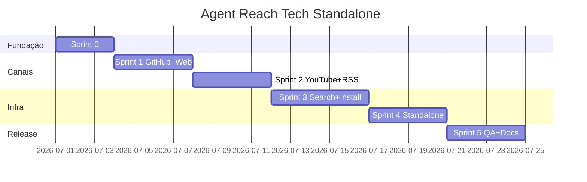

# Plano de Sprints — Agent Reach Tech Standalone

**Objetivo:** tornar `agent-reach-tech` um substituto completo do Agent Reach base para pesquisa tech/OSS/security, **sem dependência do pacote upstream**.

**Duração estimada:** 5 sprints (~2 semanas cada, ajustável)  
**Escopo:** 8 canais ativos + install + doctor + skill + workflows  
**Fora de escopo:** Bilibili, 小红书, Facebook, Instagram, 雪球, LinkedIn

---

## Visão do produto final

```
agent-reach-tech (CLI único)
├── install      → deps + skill + config agent
├── doctor       → todos os canais (tech + base reimplementado)
├── hn / lobsters / cve / osv   ✅ já existe
├── github / web / youtube / rss  ← sprints 1–2
├── search (Exa via mcporter)     ← sprint 3
└── workflows + catálogo local    ← sprint 4–5
```

**Definition of Done (projeto):**
- [x] `agent-reach-tech doctor` passa sem mencionar upstream
- [x] Nenhum `pip install` do repositório Panniantong/Agent-Reach
- [x] SKILL.md cobre todos os canais implementados
- [x] 4 workflows executáveis de ponta a ponta
- [x] Testes automatizados para canais (mock HTTP + probe)
- [x] README atualizado com matriz de canais

---

## Sprint 0 — Fundação (2–3 dias) ✅ Concluído (v0.2.0)

**Meta:** preparar arquitetura para absorver canais “base” sem quebrar o que já funciona.

### Tarefas

| ID | Tarefa | Entregável |
|----|--------|------------|
| S0.1 | Refatorar `channels/base.py` — interface comum `probe()`, `doctor_line()`, helpers HTTP/subprocess | `Channel` base estável |
| S0.2 | Criar `channels/registry.py` — registro central (substituir lista hardcoded) | `ALL_CHANNELS` dinâmico |
| S0.3 | Criar `core/deps.py` — detectar `gh`, `yt-dlp`, `curl`, `python -m feedparser` | Relatório de dependências |
| S0.4 | Criar `core/subprocess_runner.py` — wrapper seguro para CLIs externos | Utilitário testável |
| S0.5 | Estrutura de testes: `tests/` + pytest + fixtures mock | `pytest` roda vazio |
| S0.6 | Atualizar `pyproject.toml` — `[dev]`, `pytest`, opcional `feedparser` | deps declaradas |

### Critérios de aceite
- [x] `agent-reach-tech doctor` continua passando 4/4 canais tech
- [x] Novos módulos importam sem circular deps
- [x] `pytest` executa com testes offline (base, registry, deps, subprocess, doctor)

### Riscos
- Over-engineering → manter interfaces mínimas

---

## Sprint 1 — Canais essenciais: GitHub + Web (3–4 dias) ✅ Concluído (v0.3.0)

**Meta:** cobrir 60% dos workflows (`avaliar-biblioteca`, `pesquisar-oss`) sem upstream.

### Tarefas

| ID | Tarefa | Entregável |
|----|--------|------------|
| S1.1 | `channels/github.py` — probe `gh`, `repo view`, `search repos`, `search issues` | Canal GitHub |
| S1.2 | CLI: `agent-reach-tech github repo OWNER/REPO` | Comando repo |
| S1.3 | CLI: `agent-reach-tech github search repos\|issues QUERY` | Comando search |
| S1.4 | `channels/web.py` — probe Jina Reader (`r.jina.ai`) | Canal Web |
| S1.5 | CLI: `agent-reach-tech web URL` | Leitura de página |
| S1.6 | Testes mock para GitHub (subprocess) e Web (HTTP) | `tests/test_github.py`, `tests/test_web.py` |
| S1.7 | Atualizar `skill/SKILL.md` — seção GitHub + Web nativos | Skill sem referência upstream |

### Critérios de aceite
- [x] `agent-reach-tech github repo Gentleman-Programming/engram`
- [x] `agent-reach-tech web https://owasp.org`
- [x] `agent-reach-tech doctor` — github + web = OK

### Dependências externas
- `gh` CLI instalado (`winget install GitHub.cli`)

---

## Sprint 2 — Mídia e feeds: YouTube + RSS (3–4 dias) ✅ v1.0

**Meta:** tutoriais, advisories e monitoramento via feeds.

### Tarefas

| ID | Tarefa | Entregável |
|----|--------|------------|
| S2.1 | `channels/youtube.py` — probe `yt-dlp`, extrair legendas/metadata | Canal YouTube |
| S2.2 | CLI: `agent-reach-tech youtube info URL` | Metadados + legendas |
| S2.3 | CLI: `agent-reach-tech youtube search QUERY` (se suportado pelo yt-dlp) | Busca |
| S2.4 | `channels/rss.py` — probe + parse via `feedparser` | Canal RSS |
| S2.5 | CLI: `agent-reach-tech rss URL` e `agent-reach-tech rss list` (lê `config/feeds.yaml`) | Leitura de feeds |
| S2.6 | Integrar feeds curados do `config/feeds.yaml` no doctor | Status por categoria |
| S2.7 | Testes para RSS (XML fixture) e YouTube (mock subprocess) | Cobertura básica |
| S2.8 | Workflow `monitorar-tendencias.md` — remover refs upstream | Workflow standalone |

### Critérios de aceite
```powershell
agent-reach-tech rss list
agent-reach-tech rss https://hnrss.org/frontpage
agent-reach-tech youtube info "https://www.youtube.com/watch?v=..."
agent-reach-tech doctor  # 6/6 canais (tech 4 + github + web + youtube + rss)
```

### Dependências externas
- `yt-dlp` (`pip install yt-dlp` ou `winget`)
- `feedparser` (dependência Python do projeto)

---

## Sprint 3 — Busca semântica + Install unificado (4–5 dias) ✅ v1.0

**Meta:** substituir `agent-reach install` e Exa search do upstream.

### Tarefas

| ID | Tarefa | Entregável |
|----|--------|------------|
| S3.1 | `channels/exa_search.py` — probe mcporter + Exa MCP | Canal busca |
| S3.2 | `core/installer.py` — orquestrar deps por SO (Windows primeiro) | Módulo install |
| S3.3 | Expandir `install.ps1` → chamar `agent-reach-tech install --env=auto` | Install único |
| S3.4 | Detectar ambiente: local vs servidor, `--safe`, `--dry-run` | Flags de segurança |
| S3.5 | Instalar/registrar mcporter + Exa (doc no README se key necessária) | Busca configurável |
| S3.6 | CLI: `agent-reach-tech search "QUERY"` usando perfis de `search-profiles.yaml` | Busca semântica |
| S3.7 | Mapear perfis YAML → queries Exa ou fallback `gh search` | Degradação graciosa |
| S3.8 | Testes installer (dry-run) e exa (mock) | Sem side effects em CI |

### Critérios de aceite
```powershell
agent-reach-tech install --dry-run    # lista ações sem executar
agent-reach-tech install --safe       # não altera sistema, só reporta
agent-reach-tech search --profile evaluate_library --name engram
agent-reach-tech doctor               # exa = OK ou instrução clara
```

### Notas
- Exa pode exigir cadastro gratuito — documentar no README
- `--safe` espelha comportamento do upstream para servidores

---

## Sprint 4 — Doctor unificado + Reddit opcional + Standalone (3–4 dias) ✅ v1.0

**Meta:** remover completamente a dependência conceitual do upstream.

### Tarefas

| ID | Tarefa | Entregável |
|----|--------|------------|
| S4.1 | Refatorar `doctor` — seções: deps, canais tech, canais base, config | Output legível |
| S4.2 | Remover mensagens “install Agent Reach upstream” de CLI, README, install.ps1 | Zero refs upstream |
| S4.3 | `channels/reddit.py` (opcional) — probe OpenCLI ou `rdt-cli`, doc de cookie | Canal Reddit |
| S4.4 | CLI: `agent-reach-tech reddit search QUERY` (se canal ativo) | Comando reddit |
| S4.5 | `config/channels.yaml` — flag `standalone: true` | Config explícita |
| S4.6 | Integração catálogo: `agent-reach-tech catalog search TERM` (lê `manifests/projects.json`) | Ponte local |
| S4.7 | Atualizar workflows restantes (`avaliar-biblioteca`, `analisar-cve`, `pesquisar-oss`) | Sem upstream |
| S4.8 | Renomear branding no SKILL: “Agent Reach Tech” como produto principal | Identidade clara |

### Critérios de aceite
- `doctor` não menciona `agent-reach` (pacote upstream)
- Workflows rodam só com `agent-reach-tech` + `gh` + opcionais
- `catalog search engram` retorna entrada do catálogo local

---

## Sprint 5 — Qualidade, docs e release v1.0 (3–4 dias) ✅ v1.0.0

**Meta:** release estável e utilizável em outros projetos.

### Tarefas

| ID | Tarefa | Entregável |
|----|--------|------------|
| S5.1 | Suite de testes integração — `doctor` end-to-end com markers `@network` | CI local |
| S5.2 | `CHANGELOG.md` v0.1.0 → v1.0.0 | Histórico |
| S5.3 | README — matriz canais, deps, comparativo vs upstream, licença MIT | Doc completa |
| S5.4 | `docs/ARCHITECTURE.md` — diagrama channels/registry/install | Referência técnica |
| S5.5 | Script `scripts/benchmark.ps1` — latência probe por canal | Baseline performance |
| S5.6 | Atualizar `manifests/projects.json` — status standalone, remover nota “requer upstream” | Catálogo |
| S5.7 | Tag git `agent-reach-tech-v1.0.0` | Release |
| S5.8 | Smoke test com agent real: “avalie projeto X usando skill” | Validação manual |

### Critérios de aceite
- `pytest` passa offline (mocks) + opcional online
- README permite onboarding em < 10 min
- Catálogo reflete projeto autônomo

---

## Cronograma resumido



| Sprint | Duração | Canais novos | Acumulado |
|--------|---------|--------------|-----------|
| 0 | 2–3d | — | 4 (existentes) |
| 1 | 3–4d | github, web | 6 |
| 2 | 3–4d | youtube, rss | 8 |
| 3 | 4–5d | exa_search | 9 |
| 4 | 3–4d | reddit (opcional), catalog | 9–10 |
| 5 | 3–4d | — | release v1.0 |

**Total:** ~18–24 dias úteis (4–5 semanas calendário)

---

## Matriz de canais (alvo v1.0)

| Canal | Sprint | Backend | Zero-config |
|-------|--------|---------|-------------|
| hackernews | ✅ | Algolia API | Sim |
| lobsters | ✅ | RSS / hottest.json | Sim |
| cve_nvd | ✅ | NVD API 2.0 | Sim* |
| osv | ✅ | OSV.dev | Sim |
| github | 1 | gh CLI | Sim (público) |
| web | 1 | Jina Reader | Sim |
| youtube | 2 | yt-dlp | Sim |
| rss | 2 | feedparser | Sim |
| exa_search | 3 | mcporter + Exa | Auto |
| reddit | 4 | OpenCLI / rdt-cli | Não |

\* NVD funciona sem key; key aumenta rate limit

---

## Dependências entre sprints

```
S0 (base/refactor)
 └─► S1 (github, web) ──► workflows avaliar/pesquisar
      └─► S2 (youtube, rss) ──► workflow monitorar
           └─► S3 (install, search) ──► onboarding completo
                └─► S4 (standalone, catalog) ──► remoção upstream
                     └─► S5 (release)
```

---

## Riscos e mitigações

| Risco | Impacto | Mitigação |
|-------|---------|-----------|
| Jina Reader indisponível | Web quebrado | Fallback `curl` + strip HTML básico |
| NVD rate limit | CVE lento | `NVD_API_KEY` + cache local JSON |
| yt-dlp quebra com YouTube | Tutoriais | Pin de versão + teste semanal em CI |
| Exa exige key | Busca semântica off | Fallback `gh search` + HN search |
| Reddit sem login | Canal inútil | Marcar opcional; doc clara |
| Scope creep (Twitter, etc.) | Atraso | Manter backlog v1.1 |

---

## Backlog pós-v1.0 (não entra nas sprints)

- `stackoverflow` — Stack Exchange API
- `arxiv` — papers ML/security
- `twitter` — twitter-cli + cookie
- Cache SQLite para probes e CVE
- Plugin MCP nativo (`agent-reach-tech mcp`)
- Integração Engram automática (`mem_save` pós-research)
- Linux/macOS install scripts (`.sh`)

---

## Como executar cada sprint

1. Criar branch `sprint-N/nome-curto`
2. Implementar tarefas na ordem da tabela
3. Rodar `pytest` + `agent-reach-tech doctor`
4. Atualizar `CHANGELOG.md` e marcar critérios de aceite
5. PR interno / merge → `master`
6. Demo rápida com um workflow do sprint

---

## Comando de kickoff (Sprint 0)

```powershell
cd agent-reach-tech
git checkout -b sprint-0/fundacao
python -m pip install -e ".[dev]"
pytest
agent-reach-tech doctor
```